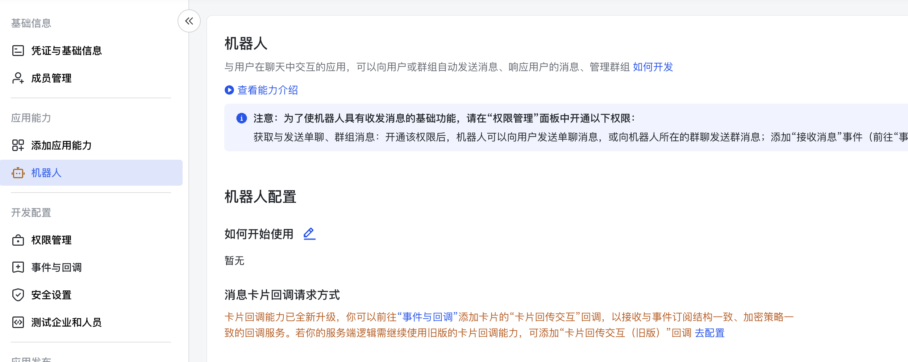
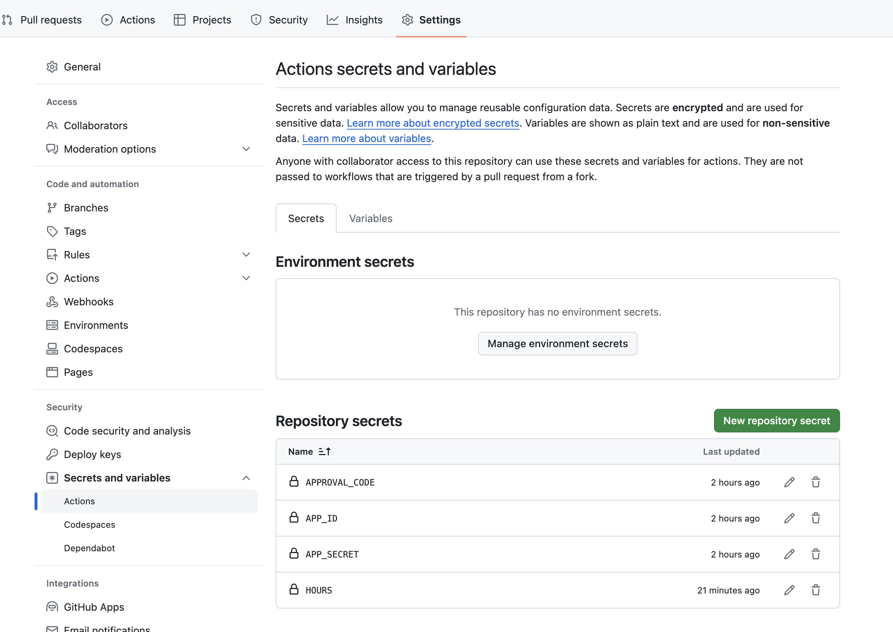

# 🐧 Feishu-On-Leave-Status-Sync

[中文](./README_CN.md) | [English](./README.md)

## 💡 Motivation

When someone applies for a leave in Feishu, his/her status is not known to others unless they are explicitly mentioned. This script aims to solve this problem by automatically updating the on-leave status on Feishu.

This repository contains a simple script and a GitHub workflow definition to automatically synchronize the on-leave status on Feishu. The job will run periodically every 2 hours by default.


## 🛠 Usage

1. Create a Feishu bot application on the [Feishu Development Platform](https://open.feishu.cn/app) and enable the bot capability.



2. Get the App ID and secret.


3. Give the application the listed permissions.
- `calendar:timeoff`
- `approval:instance`


4. You can run it locally or run it via GitHub Actions periodically.

- Run locally

```bash
python main.py \
--app-id <app-id> \
--app-secret <app-secret> \
--hours 4 \
--approval-code <approval-code>
```

- Run via GitHub Actions. You need to define the following action secrets.



## 👀 Outcome

With this script, you can see the on-leave status on Feishu is synchronized automatically.


