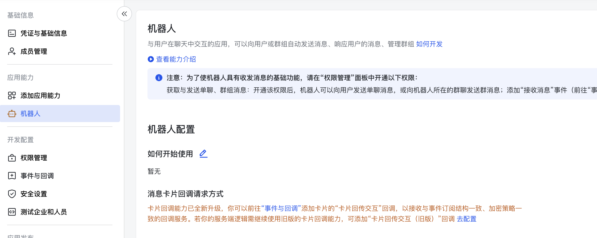
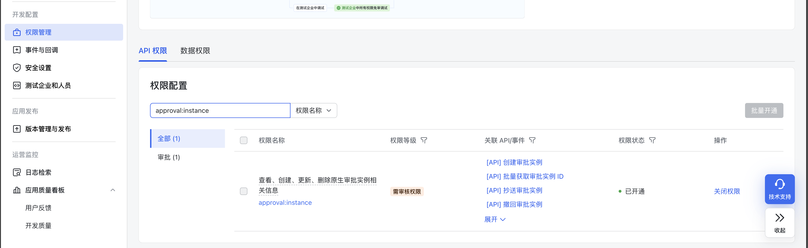
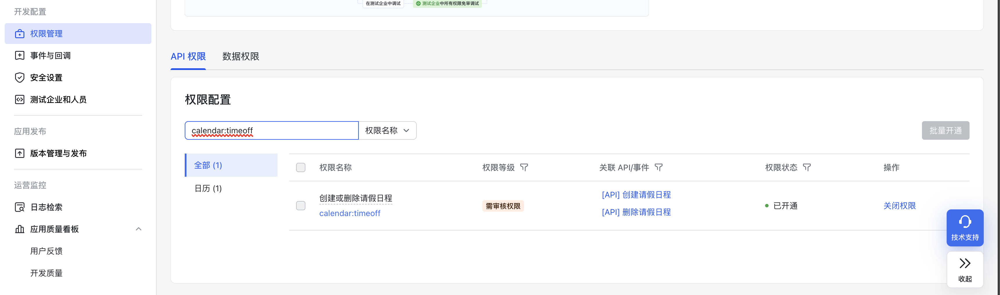
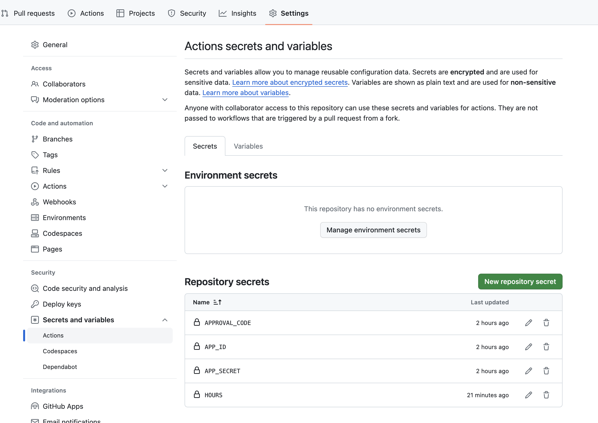

# 🐧 飞书-请假状态同步

[中文](./README_CN.md) | [English](./README.md)

## 💡 简介

当有人在飞书上申请请假时，除非他们被明确抄送，否则他们的状态对其他人来说是未知的。这个脚本旨在通过自动更新飞书上的请假状态来解决这个问题。这个仓库包含一个简单的脚本和一个 GitHub 工作流定义，用于自动同步飞书上的请假状态。默认情况下，工作流将每 2 小时运行一次。

## 🛠 使用说明

1. 在[飞书开放平台](https://open.feishu.cn/app)上创建一个飞书机器人应用程序，并启用机器人功能。



2. 获取应用的ID和Secret。


3. 给予应用以下权限：
- `calendar:timeoff`
- `approval:instance`





4. 你可以在本地运行它，也可以通过 GitHub Actions 定期运行。

- 本地运行

```bash
python main.py \
--app-id <app-id> \
--app-secret <app-secret> \
--hours 4 \
--approval-code <approval-code>
```

- 通过 GitHub Actions 运行。你需要定义以下的 action secrets。



## 👀 结果

通过这个脚本，你可以看到飞书上的请假状态是自动同步的。


